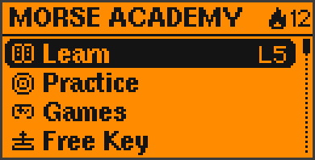
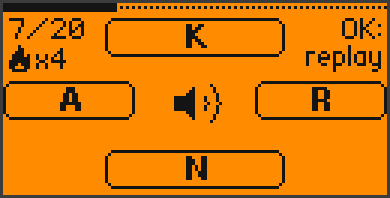
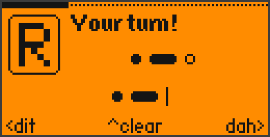
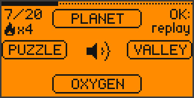
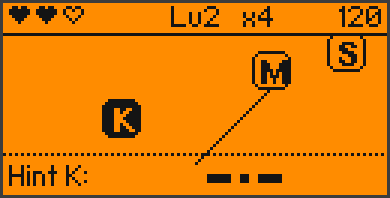
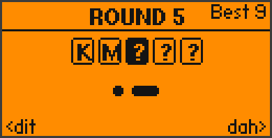
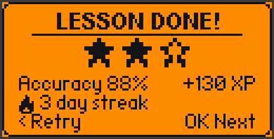
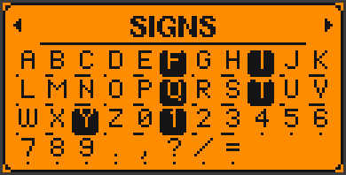
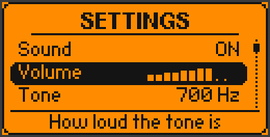

<div align="center">

# 📡 Morse Academy for Flipper Zero

**Learn Morse code from zero — right on your Flipper.**
Lessons, practice, games and a live-decoding Morse key, with sound,
vibration and the RGB LED. No extra boards needed.


[](https://github.com/King-Kong-341/Flipper-Zero-Games_Morse_Academy/actions/workflows/build.yml)

  

</div>

---

## What is this?

Morse Academy turns your Flipper Zero into a complete Morse code course.
It teaches you **by ear, by touch and by sight**: every dit and dah plays
as a tone, buzzes the vibration motor and flashes the LED — and your
Flipper's D-pad becomes a real Morse key.

You start with just two letters (E and T), and step by step work your way
up to the full alphabet, numbers, punctuation, whole words and radio
callsigns. Sessions are shuffled every time, your weak letters come back
more often, and mistakes are repeated at the end of each lesson — the same
tricks good language apps use.

## ✨ Features

| | |
|---|---|
| 🎓 **Learning path** | 18 lessons + final exam, 41 signs (A–Z, 0–9, `. , ? / =`). Each lesson: tip → meet the new signs → key them yourself → shuffled quiz |
| 🧭 **Placement test** | Tell the app how much Morse you know. "A little" starts a short listening test that unlocks what you already know |
| 👂 **Listen & send** | Hear a sign and pick it with the arrow keys, or see a sign and key it back — letters, **words** and **callsigns** |
| 🎯 **Smart practice** | Per-sign mastery tracking; weak signs are picked more often. A "Weak spots" mode trains only your 6 weakest |
| 🎮 **3 games** | **Morse Rush** (key falling letters before they land), **Sound Sprint** (60 s listening sprint), **Echo Chain** (repeat ever longer chains) |
| ⌨️ **Free Key** | Key anything — it's decoded live on screen, with automatic word spaces and playback |
| 🔤 **Alphabet** | Reference card for every sign: big pixel letter, pattern, how it sounds (*di-dah-dit*), look-alike warning, your mastery |
| 📈 **Stats** | Level & XP, daily goal, day streak, mastery grid of all 41 signs, 12 badges, game records |
| 🔊 **Sound · vibration · LED** | Everything can be switched on/off. LED colors: blue = Flipper sends, cyan = you key, green = right, red = wrong |
| ⚙️ **Settings** | Volume, tone pitch, speed (WPM), Farnsworth spacing, paddle or straight key, letter pause, hints, daily goal, keep screen on |
| 💾 **Saved automatically** | Progress and settings live on the SD card |

## 📥 Installation

### Option A — Ready-made app (easiest)

1. Download **[`morse_academy.fap`](morse_academy.fap)** (also attached to every
   [release](https://github.com/King-Kong-341/Flipper-Zero-Games_Morse_Academy/releases)).
2. Open [qFlipper](https://flipperzero.one/update) and connect your Flipper via USB.
3. In the **File Manager**, copy the file to `SD Card/apps/Games/`.
4. On the Flipper: **Menu → Apps → Games → Morse Academy**.

> Built for the **official firmware 1.x** (SDK 1.4.3). If your firmware is
> much newer or older and the app refuses to start, build it yourself (Option B).

### Option B — Build from source

You need [Python 3](https://www.python.org/downloads/) and
[`ufbt`](https://github.com/flipperdevices/flipperzero-ufbt):

```bash
pip install ufbt
python -m ufbt            # builds dist/morse_academy.fap
python -m ufbt launch     # builds, installs and starts it on a connected Flipper
```

Or use the helper scripts in [`scripts/`](scripts/) (`build.ps1` / `build.sh`,
`install.ps1` / `install.sh`).

## 🎮 Controls in one minute

| Key | While keying Morse | In menus / quizzes |
|---|---|---|
| ◀ Left | **dit** (short) | choose left answer / change value |
| ▶ Right | **dah** (long) | choose right answer / change value |
| ▲ Up | clear the current letter | choose top answer / move |
| ▼ Down | show a hint | choose bottom answer / move |
| OK | finish the letter now *(or: straight key, see settings)* | confirm / replay the sound |
| Back | pause | one screen back |
| Back (hold) | pause | main menu · in the main menu: exit |

A letter is finished automatically when you pause for a moment. Hold a
paddle to repeat it, hold both to alternate (iambic style).

📖 **Everything in detail: [User Guide](docs/USER_GUIDE.md)**

## 🖼 Screens

| | | |
|:-:|:-:|:-:|
|  |  |  |
| Listen & pick | Key it yourself | Hear whole words |
|  |  |  |
| Morse Rush | Echo Chain | Free Key |
|  |  |  |
| Lesson done | Mastery of every sign | Settings |

<sub>Screens are rendered on a PC with the Flipper's real fonts using the
preview tool in [`tools/flipper_preview`](tools/flipper_preview/) — they are
pixel-accurate, but the orange is just for looks.</sub>

## 🗂 Project structure

```
Flipper-Zero-Games_Morse_Academy/
├── application.fam          # app manifest (name, icon, category, entry point)
├── morse.h                  # shared types, app state, all declarations
├── morse_main.c             # start-up, event loop, XP / levels / streak / badges
├── morse_data.c             # Morse table, lessons, word list, badges, 5x7 pixel font
├── morse_signal.c           # tone + LED + vibration, playback, keyer, jingles
├── morse_quiz.c             # lessons, practice, placement test, results
├── morse_games.c            # Morse Rush, Sound Sprint, Echo Chain, Free Key
├── morse_menus.c            # menus, lesson path, settings, alphabet, stats, help, onboarding
├── morse_draw.c             # drawing helpers (patterns, big letters, icons, answer boxes)
├── morse_store.c            # settings + progress on the SD card
├── icon.png / make_icon.py  # 10x10 app icon and the script that draws it
├── morse_academy.fap        # ready-to-install build
├── scripts/                 # build / install helpers
├── tools/flipper_preview/   # PC preview of all screens with the real Flipper fonts
└── docs/                    # user guide, developer guide, screenshots
```

Want to add words, change lessons or understand how the keyer works?
➡️ **[Developer Guide](docs/DEVELOPMENT.md)**

## 🛠 Built with

- [ufbt](https://github.com/flipperdevices/flipperzero-ufbt) — micro Flipper Build Tool
- The official [Flipper Zero firmware](https://github.com/flipperdevices/flipperzero-firmware) SDK

## 📄 License

MIT — see [LICENSE](LICENSE).
