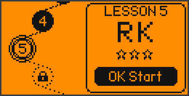
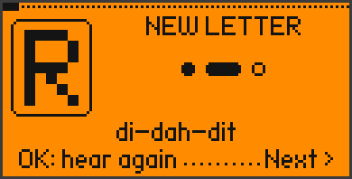
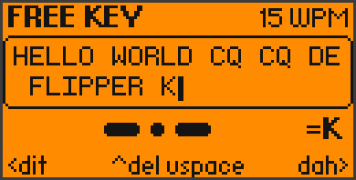

<div align="center">

# 📡 Morse Academy for Flipper Zero

**Learn Morse code from zero — right on your Flipper.**
Lessons, practice, games and a live-decoding Morse key, with sound,
vibration and the RGB LED. No extra boards needed.


[](https://github.com/King-Kong-341/Flipper-Zero-Games_Morse_Academy/actions/workflows/build.yml)

  

</div>

---

## 📁 What's in here?

| Folder | What it is | Who needs it |
|---|---|---|
| 📦 **[`Morse Academy/`](Morse%20Academy/)** | the finished app: **`morse_academy.fap`** | everyone — this is the file for your Flipper |
| 🧩 [`source/`](source/) | the C source code | only if you want to build or change the app |
| 🖼 [`images/`](images/) | the pictures on this page | — |

## 🎯 What is this?

Morse Academy turns your Flipper Zero into a complete Morse code course.
It teaches you **by ear, by touch and by sight**: every dit and dah plays
as a tone, buzzes the vibration motor and flashes the LED — and your
Flipper's D-pad becomes a real Morse key.

You start with just two letters (E and T) and work your way up step by step
to the full alphabet, numbers, punctuation, whole words and radio callsigns.
Your weak letters come back more often, and mistakes are repeated at the end
of each lesson.

## 📥 Installation

1. Open the folder **[`Morse Academy`](Morse%20Academy/)** and click
   **`morse_academy.fap`** → **Download** (the ⬇ button on the right).
   It's also on the [Releases page](https://github.com/King-Kong-341/Flipper-Zero-Games_Morse_Academy/releases).
2. Open [qFlipper](https://flipperzero.one/update) on your computer and
   connect your Flipper via USB.
3. In qFlipper's **File Manager**, copy the file to **`SD Card/apps/Games/`**.
4. On the Flipper: **Menu → Apps → Games → Morse Academy**.

> Made for the **official Flipper firmware 1.x**. If the app doesn't start
> on your firmware, build it yourself (see the end of this page).

**First start:** the app asks how much Morse you already know.
*Not at all* starts at lesson 1, *A little* runs a short placement test,
*Very well* unlocks everything. Then a 30-second tutorial shows you how to
key — and you're ready.

## 🎮 Controls

| Key | While keying Morse | In menus / quizzes |
|---|---|---|
| ◀ Left | **dit** (short) | choose left answer / change value |
| ▶ Right | **dah** (long) | choose right answer / change value |
| ▲ Up | clear the current letter | choose top answer / move |
| ▼ Down | show a hint | choose bottom answer / move |
| OK | finish the letter now *(or: straight key, see settings)* | confirm / replay the sound |
| Back | pause | one screen back |
| Back (hold) | pause | main menu · in the main menu: exit |

A letter is finished automatically when you pause for a moment. Hold a
paddle to repeat it, hold both to alternate (iambic style).

## ✨ Features

| | |
|---|---|
| 🎓 **Learning path** | 18 lessons + final exam, 41 signs (A–Z, 0–9, `. , ? / =`): tip → meet the new signs → key them → shuffled quiz |
| 👂 **Listen & send** | Hear a sign and pick it, or see a sign and key it back — letters, **words** and **callsigns** |
| 🎯 **Smart practice** | Weak signs are picked more often; "Weak spots" trains only your 6 weakest |
| 🎮 **3 games** | **Morse Rush** (key falling letters), **Sound Sprint** (60 s listening sprint), **Echo Chain** (repeat ever longer chains) |
| ⌨️ **Free Key** | Key anything — it's decoded live on screen |
| 🔤 **Alphabet** | Every sign with its pattern, how it sounds (*di-dah-dit*) and look-alike warnings |
| 📈 **Stats** | Level & XP, daily goal, day streak, mastery of all 41 signs, 12 badges, records |
| 🔊 **Sound · vibration · LED** | Each switchable. Blue = Flipper sends, cyan = you key, green = right, red = wrong |
| ⚙️ **Settings** | Volume, tone pitch, speed (WPM), Farnsworth spacing, paddle or straight key, letter pause, hints, daily goal |
| 💾 **Saved automatically** | Progress and settings live on the SD card |

## 🖼 Screens

| | | |
|:-:|:-:|:-:|
|  |  |  |
| Listen & pick | Key it yourself | Morse Rush |
|  |  |  |
| Free Key | Mastery of every sign | Settings |

## 🛠 Build it yourself

Only needed if the ready-made file doesn't work on your firmware or you want
to change something. You need [Python 3](https://www.python.org/downloads/):

```bash
pip install ufbt
cd source
python -m ufbt            # -> source/dist/morse_academy.fap
python -m ufbt launch     # or: build, install and start it on a connected Flipper
```

Words and lessons are in [`source/morse_data.c`](source/morse_data.c).

---

MIT licensed, see [LICENSE](LICENSE).
