# 📖 Morse Academy — User Guide

Everything the app can do, screen by screen.
New to Morse? Just start the app and follow it — this guide is for looking
things up.

- [First start](#-first-start)
- [How to key Morse on the Flipper](#-how-to-key-morse-on-the-flipper)
- [Learn — the lesson path](#-learn--the-lesson-path)
- [Practice](#-practice)
- [Games](#-games)
- [Free Key](#-free-key)
- [Alphabet](#-alphabet)
- [Stats, XP, streak & badges](#-stats-xp-streak--badges)
- [Settings](#-settings)
- [Sound, vibration & LED](#-sound-vibration--led)
- [Tips for learning Morse](#-tips-for-learning-morse)
- [FAQ](#-faq)

---

## 🚀 First start

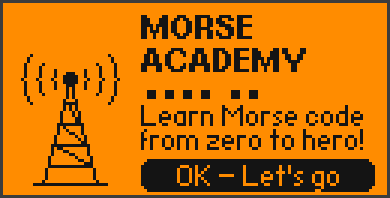 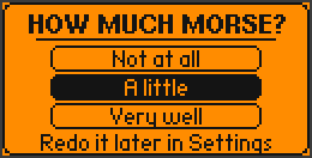 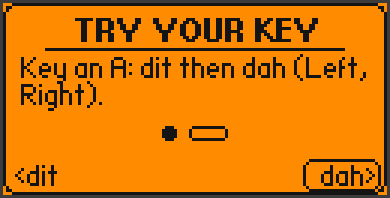

1. **Welcome** — press OK.
2. **How much Morse?** — pick one:

   | Choice | What happens |
   |---|---|
   | **Not at all** | You start at lesson 1. Speed 15 WPM, spacing 8 WPM |
   | **A little** | A short **placement test** follows (see below). Speed 16 / spacing 10 |
   | **Very well** | All lessons are unlocked. Speed 20 / spacing 15 |

3. **Try your key** — a 30-second interactive tutorial: press ◀ for a dit,
   ▶ for a dah, then key an **A** (dit-dah). After that you're ready.

You can redo the placement test at any time: **Settings → Placement test**.

### Placement test

You hear signs and pick the right one with the arrow keys — two questions
per lesson, in lesson order. The test stops at the first miss; every lesson
before that point is marked as done (1 star) and unlocked. The test never
locks anything you already had.

---

## ⌨️ How to key Morse on the Flipper

Your D-pad is an **electronic paddle key**:

| Key | Meaning |
|---|---|
| ◀ Left | **dit** — short signal (`.`) |
| ▶ Right | **dah** — long signal (`-`), three times as long as a dit |
| hold ◀ or ▶ | repeats the element (`....` for H is just: hold ◀) |
| hold both | alternates dit and dah (iambic keying) |
| pause | the letter is finished — the pause length is set in **Settings → Letter pause** |
| OK | finish the letter immediately (no need to wait) |
| ▲ Up | clear what you keyed so far |
| ▼ Down | show a hint (the pattern) — counts as a miss in quizzes |

You hear your own signal as a side tone and the LED lights up **cyan**
while you key. The app times the elements for you, so your dits and dahs are
always perfect.

### Straight key mode

Prefer one button like a classic telegraph key?
**Settings → Keyer → Straight.** Then hold **OK**: a short press is a dit,
a long press a dah. The app learns your personal rhythm (the dit/dah border
adapts to your average dit length). ◀ and ▶ still work as paddles.

---

## 🎓 Learn — the lesson path

 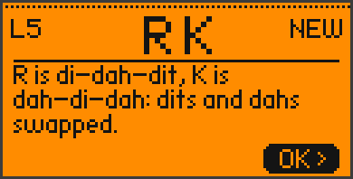 

Open **Learn** to see the path. ▲/▼ move along it, OK starts the selected
lesson. Filled circles are finished lessons, the ring marks the next one,
dotted circles with a lock are still locked.

### The 18 lessons

Signs are taught in **contrasting pairs** — E/T, I/M, A/N, S/O … — because
opposites are the easiest to tell apart, and because these letters already
form lots of real words early on.

| # | New signs | # | New signs | # | New signs |
|---|---|---|---|---|---|
| 1 | E T | 7 | G W | 13 | J Q |
| 2 | I M | 8 | H B | 14 | 1 2 3 |
| 3 | A N | 9 | L F | 15 | 4 5 6 |
| 4 | S O | 10 | C Y | 16 | 7 8 9 0 |
| 5 | R K | 11 | P X | 17 | . , |
| 6 | D U | 12 | V Z | 18 | ? / = |
| | | | | 🏁 | **Final exam** — everything mixed |

### What happens in a lesson

1. **Tip** — a one-screen explanation of the new signs.
2. **Meet the sign** — big letter, the pattern and how it sounds
   (*di-dah-dit*). It plays automatically; OK plays it again, ▶ continues.
   The pattern lights up element by element while it plays.
3. **Your turn** — key the new sign yourself. The pattern is shown and
   fills up as you key it right.
4. **Quiz** — about 15 shuffled questions:
   - **Listen** — you hear a sign, pick it with the arrow key that points
     to it. OK replays the sound.
   - **Send** — you see a sign and key it from memory.
   - **Hear a word / Send a word** — from lesson 3 on, using only letters you
     already know (233 common English words).

  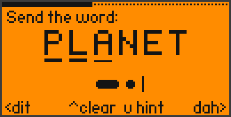

**Mistakes:** you see (and hear) the right answer, and that question comes
back at the end of the lesson. When sending you get two tries (three wrong
letters for a word) before the answer is revealed.

**Stars:** 70 % right on the first try = ⭐, 85 % = ⭐⭐, 95 % = ⭐⭐⭐.
One star unlocks the next lesson. You can replay any lesson for more stars.

 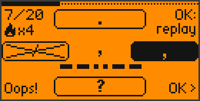 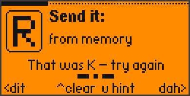

---

## 🎯 Practice

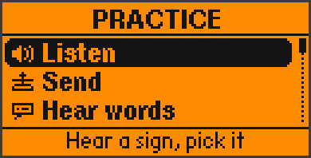  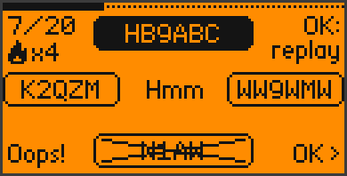

Free training with everything you've learned so far. Signs with low mastery
are picked more often.

| Mode | What you do | Unlocks |
|---|---|---|
| **Listen** | 20 × hear a sign, pick it | always |
| **Send** | 14 × see a sign, key it | always |
| **Hear words** | 14 × hear a word, pick it | enough known letters (≈ lesson 3) |
| **Send words** | 8 × key a whole word | enough known letters |
| **Weak spots** | 16 × listen + send, mostly your 6 weakest signs | always |
| **Callsigns** | 12 × copy radio callsigns like `DL4XY` or `W1ABC` | after lesson 16 (numbers) |

At the end you see your accuracy and XP. OK starts the same mode again.

---

## 🎮 Games

 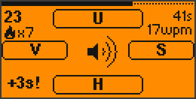 

All games use only the signs you've learned. Your best score per game is saved.

### 🚀 Morse Rush
Letters fall down in five lanes. **Key a letter to blast it** — the lowest
matching one is hit. A letter that reaches the ground costs a heart (you
have 3), and the app shows you its pattern so you learn from it.

- 10 points per letter + combo bonus (up to +20)
- every 100 points: next level, faster letters, more at once
- with **Hints** on, the pattern of the lowest letter is shown at the bottom

### ⚡ Sound Sprint
60 seconds. Hear a sign, pick it with the arrows — as many as you can.

- right: +1 point (more with a combo), wrong: −3 seconds
- every 5 in a row: the signs get 1 WPM faster
- every 10 in a row: +3 seconds bonus

### 🔗 Echo Chain
Like the classic memory game — but in Morse. You hear a chain of signs;
key it back in the right order. Every round the chain grows by one. One
mistake ends the game. Your score is the longest chain you repeated.

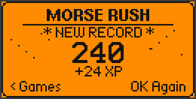

---

## ⌨️ Free Key

Key anything you like — the app decodes it live. Unknown patterns appear
as `*`. A long pause adds a space automatically.

| Key | Action |
|---|---|
| ◀ / ▶ | dit / dah |
| ▲ | delete last letter (or the pattern you're keying) |
| hold ▲ | clear everything |
| ▼ | add a space |
| hold ▼ | play back what you've written |

In straight-key mode the top right shows your actual keying speed.

---

## 🔤 Alphabet

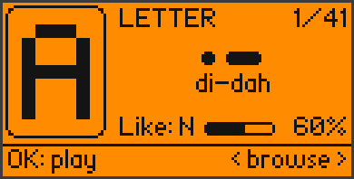 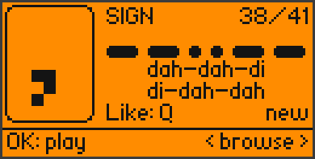

A reference card for all 41 signs: big pixel letter, pattern, how it sounds,
a **look-alike** that is easy to confuse with it, and your mastery in %.

◀ / ▶ browse · ▲ / ▼ jump between letters, numbers and punctuation · OK plays it.

---

## 📈 Stats, XP, streak & badges

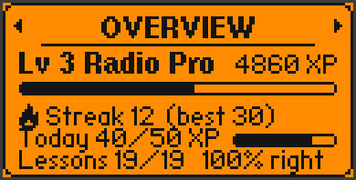  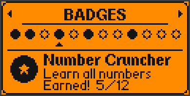 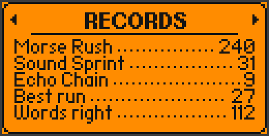

◀ / ▶ switch between the four pages.

- **Overview** — level, XP bar, streak, today's XP vs. daily goal, lessons done, overall accuracy
- **Signs** — all 41 signs with a mastery bar; inverted = mastered (80 %+), dot = not learned yet
- **Badges** — ▲ / ▼ select a badge to see what it's for
- **Records** — best scores of the games, longest run of right answers, words right

### XP

| Action | XP |
|---|---|
| right answer in a lesson (first try) | 10 |
| right answer in practice (first try) | 5 |
| lesson passed | 20 + 10 per star |
| practice session finished | 10 |
| Morse Rush / Sound Sprint / Echo Chain | score ÷ 10 / score × 2 / chain × 5 |

Levels: 60 XP for level 2, 240 for level 3, 540 for level 4 … with titles
from *Beginner* to *Legend*.

### Daily goal & streak
Earn your daily goal (20 / 50 / 100 / 150 XP, see Settings) and the flame in
the main menu turns solid. Practicing on consecutive days builds your
**streak** — skip a day and it starts again at 1.
The streak uses the Flipper's clock, so make sure the date is set (qFlipper
sets it automatically when you connect).

### Badges

| Badge | How to get it |
|---|---|
| First Steps | finish lesson 1 |
| Save Our Souls | learn S and O (lesson 4) |
| Alphabet | learn all letters (lesson 13) |
| Number Cruncher | learn all numbers (lesson 16) |
| Graduate | pass the final exam |
| Perfectionist | 3 stars in a lesson |
| On Fire | 3-day streak |
| Unstoppable | 7-day streak |
| Sharp Ear | 20 right answers in a row |
| Wordsmith | 50 words right |
| Rush Hero | 100 points in Morse Rush |
| Speedster | finish a session at 20+ WPM |

---

## ⚙️ Settings

 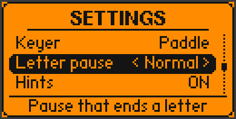

▲ / ▼ select · ◀ / ▶ change · OK toggles or runs an action. The line at
the bottom always explains the selected setting.

| Setting | Values | Meaning |
|---|---|---|
| Sound | on / off | tone for dits and dahs and the jingles |
| Volume | 0–100 % | loudness |
| Tone | 400–1000 Hz | pitch of the Morse tone (plays a preview) |
| Vibration | on / off | buzz along with the signal when the Flipper sends, and on results |
| LED | on / off | colored light, see below |
| Speed | 5–40 WPM | how fast **each sign** is played |
| Spacing | 3 – Speed WPM | effective speed: extra pause **between** signs (Farnsworth method) |
| Keyer | Paddle / Straight | ◀ ▶ paddles, or hold OK as a straight key |
| Letter pause | Short / Normal / Long | how long you pause before a keyed letter counts as finished |
| Hints | on / off | allows ▼ hints and shows hints in Morse Rush |
| Daily goal | 20 / 50 / 100 / 150 XP | your daily target |
| Screen on | on / off | keeps the backlight on while the app is open |
| Test speed | OK | plays the word PARIS at your current settings |
| Placement test | OK | redo the placement test |
| Reset progress | OK | deletes lessons, XP, stars, badges and stats (settings stay) |

**Speed vs. spacing:** Learners should hear the signs at a real speed (so
they learn the *sound*, not count dots) but get time to think between them.
That's why the default is 15 WPM signs with 8 WPM spacing. When you get
better, raise the spacing until it equals the speed.

---

## 🔊 Sound, vibration & LED

| LED | Meaning |
|---|---|
| 🔵 blue | the Flipper is sending Morse |
| 🩵 cyan | you are keying |
| 🟢 green | right answer |
| 🔴 red | wrong answer / lost a heart |
| 🟣 magenta | badge unlocked |
| 🟡 yellow | daily goal reached |

The vibration motor follows the Flipper's signal exactly, so you can even
**learn by touch** with the sound off. On your own keying it stays quiet;
it only buzzes on mistakes and results.

---

## 💡 Tips for learning Morse

- **Learn the rhythm, not the dots.** Say it out loud: *di-dah* is A,
  *dah-di-dah* is K. Counting dots slows you down later.
- **Little and often.** Ten minutes a day beats an hour on Sunday — the
  streak helps you stick with it.
- **Use Weak spots.** It trains exactly the signs you mix up.
- **Raise the spacing slowly** once lessons feel easy.
- **Look-alikes** in the alphabet screen show which signs you'll confuse —
  practice those pairs together.

---

## ❓ FAQ

**The app doesn't start / "API mismatch".**
It's built for the official firmware 1.x. Update your Flipper, or build the
app yourself for your firmware (`python -m ufbt`, see the README).

**My letters get split into two / joined together.**
Change **Settings → Letter pause**: *Long* if you key slowly, *Short* if
you're fast. Or press OK to finish each letter yourself.

**I hear nothing.**
Check **Sound** and **Volume** in the settings and the Flipper's own volume.

**The streak reset although I practiced.**
The streak needs the Flipper's clock to be set — connect it to qFlipper once.

**Where is my progress stored?**
On the SD card in `apps_data/morse_academy/` (`settings.bin`, `progress.bin`).
Deleting these files resets the app.
